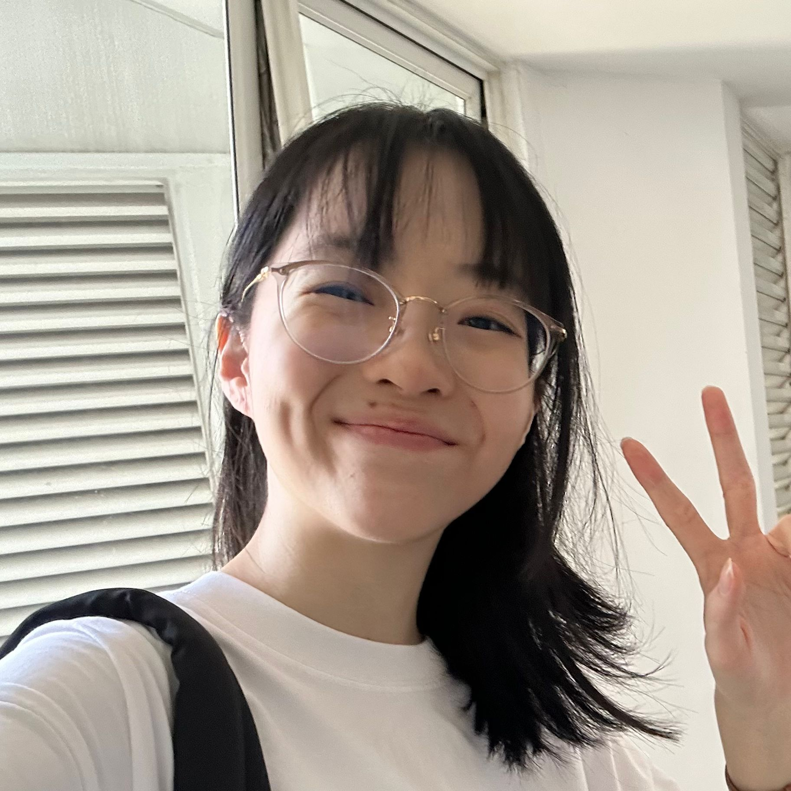

We are a team based in the [School of Computing, National University of Singapore](https://www.comp.nus.edu.sg).

You can reach us at the email `seer[at]comp.nus.edu.sg`

## Project team

### Cameron Yeo

[[github](https://github.com/CamYeo)]

* Role: Project Advisor

### Jordan Goh

[[github](https://github.com/JordanGoh4)]

* Role: Team Member
* Responsibilities: UI

### Wang Junwei

[[github](http://github.com/wjunwei2001)]

* Role: Developer
* Responsibilities: Data

### Chloe Low

[[github](https://github.com/chloryfish)]

* Role: Developer
* Responsibilities: 

### James Doe

[[github](http://github.com/johndoe)]
[[portfolio](team/johndoe.md)]

* Role: Developer
* Responsibilities: UI
