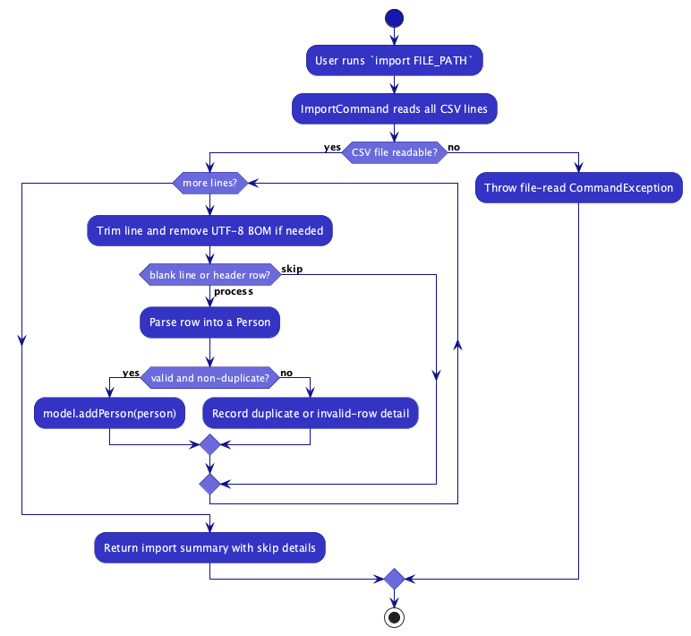
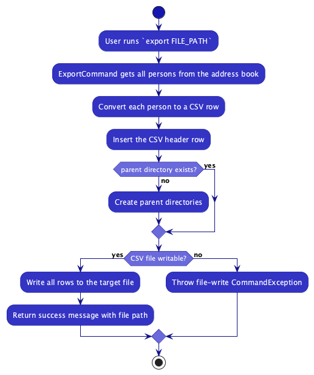
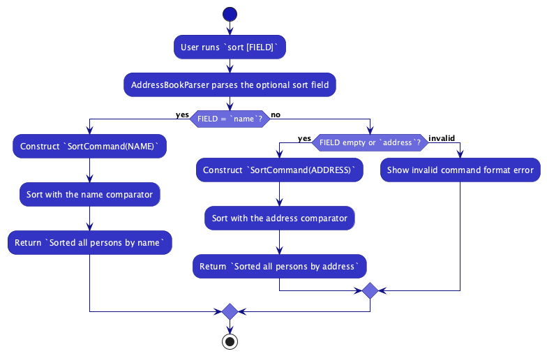
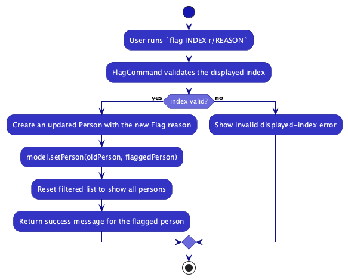
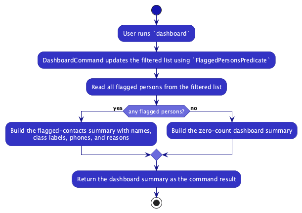

* Table of Contents
{:toc}

--------------------------------------------------------------------------------------------------------------------

## **Acknowledgements**

* This project is based on the [AddressBook-Level3](https://github.com/se-edu/addressbook-level3) project created by the [SE-EDU initiative](https://se-education.org).
* Libraries used include [JavaFX](https://openjfx.io/), [Jackson](https://github.com/FasterXML/jackson), and [JUnit 5](https://github.com/junit-team/junit5).

--------------------------------------------------------------------------------------------------------------------

## **Setting up, getting started**

Refer to the guide [_Setting up and getting started_](SettingUp.md).

--------------------------------------------------------------------------------------------------------------------

## **Design**

<div markdown="span" class="alert alert-primary">

:bulb: **Tip:** The `.puml` files used to create diagrams are in this document `docs/diagrams` folder. Refer to the [_PlantUML Tutorial_ at se-edu/guides](https://se-education.org/guides/tutorials/plantUml.html) to learn how to create and edit diagrams.
</div>

### Architecture


The ***Architecture Diagram*** given above explains the high-level design of the App.

Given below is a quick overview of main components and how they interact with each other.

**Main components of the architecture**

**`Main`** (consisting of classes [`Main`](https://github.com/se-edu/addressbook-level3/tree/master/src/main/java/seedu/address/Main.java) and [`MainApp`](https://github.com/se-edu/addressbook-level3/tree/master/src/main/java/seedu/address/MainApp.java)) is in charge of the app launch and shut down.
* At app launch, it initializes the other components in the correct sequence, and connects them up with each other.
* At shut down, it shuts down the other components and invokes cleanup methods where necessary.

The bulk of the app's work is done by the following four components:

* [**`UI`**](#ui-component): The UI of the App.
* [**`Logic`**](#logic-component): The command executor.
* [**`Model`**](#model-component): Holds the data of the App in memory.
* [**`Storage`**](#storage-component): Reads data from, and writes data to, the hard disk.

[**`Commons`**](#common-classes) represents a collection of classes used by multiple other components.

**How the architecture components interact with each other**

The *Sequence Diagram* below shows how the components interact with each other for the scenario where the user issues the command `delete 1`.


Each of the four main components (also shown in the diagram above),

* defines its *API* in an `interface` with the same name as the Component.
* implements its functionality using a concrete `{Component Name}Manager` class (which follows the corresponding API `interface` mentioned in the previous point.

For example, the `Logic` component defines its API in the `Logic.java` interface and implements its functionality using the `LogicManager.java` class which follows the `Logic` interface. Other components interact with a given component through its interface rather than the concrete class (reason: to prevent outside component's being coupled to the implementation of a component), as illustrated in the (partial) class diagram below.


The sections below give more details of each component.

### UI component

The **API** of this component is specified in [`Ui.java`](https://github.com/se-edu/addressbook-level3/tree/master/src/main/java/seedu/address/ui/Ui.java)


The UI consists of a `MainWindow` that is made up of parts e.g.`CommandBox`, `ResultDisplay`, `PersonListPanel`, `StatusBarFooter` etc. All these, including the `MainWindow`, inherit from the abstract `UiPart` class which captures the commonalities between classes that represent parts of the visible GUI.

The `UI` component uses the JavaFx UI framework. The layout of these UI parts are defined in matching `.fxml` files that are in the `src/main/resources/view` folder. For example, the layout of the [`MainWindow`](https://github.com/se-edu/addressbook-level3/tree/master/src/main/java/seedu/address/ui/MainWindow.java) is specified in [`MainWindow.fxml`](https://github.com/se-edu/addressbook-level3/tree/master/src/main/resources/view/MainWindow.fxml)

The `UI` component,

* executes user commands using the `Logic` component.
* listens for changes to `Model` data so that the UI can be updated with the modified data.
* keeps a reference to the `Logic` component, because the `UI` relies on the `Logic` to execute commands.
* depends on some classes in the `Model` component, as it displays `Person` object residing in the `Model`.

### Logic component

**API** : [`Logic.java`](https://github.com/se-edu/addressbook-level3/tree/master/src/main/java/seedu/address/logic/Logic.java)

Here's a (partial) class diagram of the `Logic` component:


The sequence diagram below illustrates the interactions within the `Logic` component, taking `execute("delete 1")` API call as an example.


<div markdown="span" class="alert alert-info">:information_source: **Note:** The lifeline for `DeleteCommandParser` should end at the destroy marker (X) but due to a limitation of PlantUML, the lifeline continues till the end of diagram.
</div>

How the `Logic` component works:

1. When `Logic` is called upon to execute a command, it is passed to an `AddressBookParser` object which in turn creates a parser that matches the command (e.g., `DeleteCommandParser`) and uses it to parse the command.
1. This results in a `Command` object (more precisely, an object of one of its subclasses e.g., `DeleteCommand`) which is executed by the `LogicManager`.
1. The command can communicate with the `Model` when it is executed (e.g. to delete a person).<br>
   Note that although this is shown as a single step in the diagram above (for simplicity), in the code it can take several interactions (between the command object and the `Model`) to achieve.
1. The result of the command execution is encapsulated as a `CommandResult` object which is returned back from `Logic`.

Here are the other classes in `Logic` (omitted from the class diagram above) that are used for parsing a user command:


How the parsing works:
* When called upon to parse a user command, the `AddressBookParser` class creates an `XYZCommandParser` (`XYZ` is a placeholder for the specific command name e.g., `AddCommandParser`) which uses the other classes shown above to parse the user command and create a `XYZCommand` object (e.g., `AddCommand`) which the `AddressBookParser` returns back as a `Command` object.
* All `XYZCommandParser` classes (e.g., `AddCommandParser`, `DeleteCommandParser`, ...) inherit from the `Parser` interface so that they can be treated similarly where possible e.g, during testing.
* **Command words are case-insensitive.** `AddressBookParser` lowercases the command word before dispatching to the matching parser, so `ADD`, `Add`, and `add` are all treated identically. Commands such as `find` and `help` additionally normalise their arguments — `find` keyword matching uses `StringUtil#containsWordIgnoreCase`, and `HelpCommandParser` lowercases the target command word before looking it up in `HelpCommand#COMMAND_USAGES`. As a result, `Help ADD`, `help Add`, and `help add` all return the usage for the `add` command.

### Model component
**API** : [`Model.java`](https://github.com/se-edu/addressbook-level3/tree/master/src/main/java/seedu/address/model/Model.java)


The `Model` component,

* stores the address book data i.e., all `Person` objects (which are contained in a `UniquePersonList` object).
* stores the currently 'selected' `Person` objects (e.g., results of a search query) as a separate _filtered_ list which is exposed to outsiders as an unmodifiable `ObservableList<Person>` that can be 'observed' e.g. the UI can be bound to this list so that the UI automatically updates when the data in the list change.
* stores a `UserPref` object that represents the user’s preferences. This is exposed to the outside as a `ReadOnlyUserPref` objects.
* does not depend on any of the other three components (as the `Model` represents data entities of the domain, they should make sense on their own without depending on other components)

<div markdown="span" class="alert alert-info">:information_source: **Note:** An alternative (arguably, a more OOP) model is given below. It has a `Tag` list in the `AddressBook`, which `Person` references. This allows `AddressBook` to only require one `Tag` object per unique tag, instead of each `Person` needing their own `Tag` objects.<br>


</div>


### Storage component

**API** : [`Storage.java`](https://github.com/se-edu/addressbook-level3/tree/master/src/main/java/seedu/address/storage/Storage.java)


The `Storage` component,
* can save both address book data and user preference data in JSON format, and read them back into corresponding objects.
* inherits from both `AddressBookStorage` and `UserPrefStorage`, which means it can be treated as either one (if only the functionality of only one is needed).
* depends on some classes in the `Model` component (because the `Storage` component's job is to save/retrieve objects that belong to the `Model`)

### Common classes

Classes used by multiple components are in the `seedu.address.commons` package.

--------------------------------------------------------------------------------------------------------------------

## **Implementation**

This section describes some noteworthy details on how certain features are implemented.

### Undo/Redo feature

#### Implementation

The undo/redo mechanism uses a simplified snapshot approach. Instead of maintaining a full version history, `ModelManager` stores up to two snapshots of the address book:

* `previousAddressBook` -- a copy of the address book state before the most recent mutating command (used by `undo`)
* `redoAddressBook` -- a copy of the address book state before the most recent `undo` (used by `redo`)

These are exposed in the `Model` interface as:

* `Model#saveCurrentState()` -- Saves a snapshot of the current address book for potential undo.
* `Model#canUndoAddressBook()` -- Returns true if there is a saved previous state.
* `Model#undoAddressBook()` -- Restores the address book to the previous state.
* `Model#canRedoAddressBook()` -- Returns true if there is a saved redo state.
* `Model#redoAddressBook()` -- Restores the address book to the state before the most recent undo.

The snapshot saving is handled in `LogicManager#execute()`, which calls `Model#saveCurrentState()` only before executing a mutating command. Read-only commands (`help`, `list`, `find`, `filter`, `export`, `dashboard`, `exit`) and undo/redo themselves are excluded via the `isMutatingCommand()` helper so that they do not overwrite the saved snapshot:

```java
Command command = addressBookParser.parseCommand(commandText);
if (isMutatingCommand(command)) {
    model.saveCurrentState();
}
commandResult = command.execute(model);
```

Given below is an example usage scenario and how the undo/redo mechanism behaves at each step.

Step 1. The user launches the application. Both `previousAddressBook` and `redoAddressBook` are `null`. There is nothing to undo or redo.

Step 2. The user executes `delete 5` to delete the 5th person. Before the command executes, `LogicManager` calls `Model#saveCurrentState()`, which saves a copy of the current address book into `previousAddressBook` and clears `redoAddressBook`. The `delete` command then executes normally.

Step 3. The user decides the delete was a mistake and executes `undo`. The `UndoCommand` calls `Model#undoAddressBook()`, which:
1. Saves the current (post-delete) state into `redoAddressBook`
2. Restores `previousAddressBook` as the active address book
3. Sets `previousAddressBook` to `null`

The deleted person is now restored.

Step 4. The user changes their mind again and executes `redo`. The `RedoCommand` calls `Model#redoAddressBook()`, which:
1. Saves the current (restored) state into `previousAddressBook`
2. Restores `redoAddressBook` as the active address book
3. Sets `redoAddressBook` to `null`

The person is deleted again.

Step 5. The user executes a new mutating command (e.g. `add n/David`). `LogicManager` calls `Model#saveCurrentState()`, which saves the current state into `previousAddressBook` and clears `redoAddressBook`. Since a new command was executed, redo is no longer available.

<div markdown="span" class="alert alert-info">:information_source: **Note:** Only one level of undo/redo is supported. This is a deliberate simplification -- teachers primarily need a safety net for the most recent accidental action (e.g. accidental `clear` or `delete`), not a full multi-step history.

</div>

<div markdown="span" class="alert alert-info">:information_source: **Note:** If a command fails during execution (e.g. invalid index), the state was already saved by `LogicManager` before execution. However, since the address book was not actually modified, the saved snapshot is identical to the current state, so an `undo` would have no visible effect.

</div>

#### Design considerations:

**Aspect: How undo & redo executes:**

* **Alternative 1 (current choice):** Saves a single snapshot of the entire address book before each mutating command.
  * Pros: Simple to implement. No changes required to individual commands. No coordination needed with other developers adding new commands.
  * Cons: Only supports one level of undo/redo. Uses memory proportional to the size of the address book for each snapshot.

* **Alternative 2:** Full versioned address book with a state history list and pointer (as in AB4).
  * Pros: Supports multi-step undo/redo.
  * Cons: More complex to implement. Every mutating command must call `commitAddressBook()`, requiring coordination across the team. Higher memory usage with many states stored.

* **Alternative 3:** Individual command knows how to undo/redo by itself (command pattern).
  * Pros: Uses less memory (e.g. for `delete`, only saves the deleted person).
  * Cons: Every command must implement its own undo logic correctly. High implementation burden and risk of bugs.

Alternative 1 was chosen because it provides the most important safety net (recovering from the last mistake) with minimal implementation complexity and zero impact on other team members' features.

### \[Proposed\] Data archiving

TeacherBook CLI does not include a dedicated data-archiving feature in v1.6.

At the moment, the application keeps all contacts in a single local JSON data file and supports CSV export/import for backup or archival workflows outside the app.

A future version could introduce a dedicated archive command that moves inactive contacts into a separate archive file while preserving their class, tags, remarks, and follow-up flags.

### Import/Export CSV feature

#### Implementation

The import/export feature is implemented in the `Logic` component using two commands:

* `ImportCommand` + `ImportCommandParser`
* `ExportCommand` + `ExportCommandParser`

Both commands are routed in `AddressBookParser` and executed by `LogicManager`, after which the normal autosave pipeline persists the updated `AddressBook` state.

The activity diagrams below summarize the main control flow for the `import` and `export` commands.





**Import (`import FILE_PATH`)**

* Reads the CSV file line by line.
* Supports quoted CSV values (including commas in addresses).
* Ignores a header row if the first cell is `name`.
* Known limitation: the header detection is currently string-based. If the first data row starts with `name`, that row can be skipped as a header without a row-level skip reason.
* Converts each row into a `Person` using existing parser utilities (`ParserUtil`) so field validation remains consistent with `add`.
* Duplicate detection uses `Model#hasPerson`, which relies on identity (`Person#isSamePerson`), i.e. same name.
* Invalid or duplicate rows are skipped and summarized in the command result.
* Up to 10 row-level skip reasons are included to help users debug malformed input.
* Strips UTF-8 BOM from the start of a line to handle CSVs exported from spreadsheet tools.

**Export (`export FILE_PATH`)**

* Serializes all persons from `model.getAddressBook().getPersonList()` into CSV.
* Writes header `name,phone,email,address,class,tags`.
* Escapes CSV values containing commas, quotes, or newlines.
* Exports tags as a semicolon-separated list.
* Creates parent directories if they do not exist.

#### Design considerations

* **Validation reuse:** import uses existing domain parsers instead of custom validators to avoid duplicated validation logic.
* **Partial success behavior:** invalid rows are skipped while valid rows are imported, improving usability for large datasets with small data issues.
* **User feedback:** row-level skip reasons are included for troubleshooting but capped for readability.

#### Manual testing

**Import**

1. Run: `import C:\data\contacts.csv` with a valid file.
   * Expected: valid rows are added and summary message shows imported count.
2. Include invalid rows (e.g. invalid phone/email).
   * Expected: rows are skipped with reasons in the result message.
3. Include a duplicate name.
   * Expected: duplicate row is skipped with a duplicate reason.

**Export**

1. Run: `export C:\data\out.csv`.
   * Expected: CSV file is created with header and all current contacts.
2. Export to a nested non-existing folder.
   * Expected: directories are created and export succeeds.
3. Export to an invalid/inaccessible path.
   * Expected: command fails with a file write error message.

### Unified sort feature

#### Implementation

Sorting is implemented using a single command:

* `SortCommand` (command word: `sort`)

`AddressBookParser` parses optional sort arguments and constructs `SortCommand` with a sort field:

* `sort` or `sort address` -> `SortField.ADDRESS`
* `sort name` -> `SortField.NAME`

`SortCommand` then selects the corresponding comparator and calls `Model#sortPersonList(...)`.

The activity diagram below summarizes how `sort` chooses the requested field and applies the corresponding comparator.



#### Design considerations

* **Single-command design:** using one command with a field parameter avoids duplicate command classes for each sort mode.
* **Extensibility:** adding future sort fields (e.g. `phone`, `class`) only requires extending the enum/parser branch and comparator mapping.
* **Backward compatibility:** `sort` continues to work with default address sorting.

#### Manual testing

1. Run `sort`.
   * Expected: persons are sorted by address.
2. Run `sort address`.
   * Expected: same behaviour as `sort`.
3. Run `sort name`.
   * Expected: persons are sorted by name.
4. Run `sort invalidField`.
   * Expected: invalid command format error with sort usage.

### Flag, Unflag, and Dashboard feature

#### Implementation

The flag/unflag/dashboard feature allows teachers to mark students who need follow-up and view a consolidated summary. It is implemented using three commands:

* `FlagCommand` + `FlagCommandParser` — marks a person as flagged with a required reason (via `r/REASON`).
* `UnflagCommand` + `UnflagCommandParser` — removes the flag from a person.
* `DashboardCommand` — filters the person list to show only flagged persons and displays a formatted summary.

Each `Person` has an optional `Flag` field. When a person is flagged, the `Flag` object stores the reason string. The `FlaggedPersonsPredicate` is used by `DashboardCommand` to filter the displayed list to only flagged contacts.

Flagging and unflagging are mutating commands (they modify person data), so they are compatible with the undo/redo system. `DashboardCommand` is read-only (it only filters the view) and does not affect undo state.

The activity diagrams below summarize the main command flow for `flag` and `dashboard`.





#### Design considerations

* **Separate flag/unflag commands:** Using distinct commands (rather than a toggle) makes the intent explicit and avoids accidental unflagging.
* **Reason required for flag:** Requiring a reason ensures the dashboard summary is useful — teachers can see at a glance *why* each student needs attention.
* **Dashboard as a filter:** The dashboard command reuses the existing filtered list mechanism, so the UI updates naturally without a separate view.

#### Manual testing

1. Flag a person with a reason.
   * Run: `flag 1 r/Missing consent form`
   * Expected: The 1st person is flagged. A visual indicator appears on their card. Status message confirms the flag.

2. Flag a person who is already flagged.
   * Run: `flag 1 r/New reason`
   * Expected: The flag reason is updated to the new reason.

3. Flag without a reason.
   * Run: `flag 1` or `flag 1 r/`
   * Expected: Error message indicating a reason must be provided.

4. Unflag a flagged person.
   * Run: `unflag 1`
   * Expected: The flag is removed. The visual indicator disappears. Status message confirms the unflag.

5. Unflag a person who is not flagged.
   * Run: `unflag 1` (on an unflagged person)
   * Expected: Error message indicating the person is not flagged.

6. View the dashboard.
   * Prerequisites: At least one person is flagged.
   * Run: `dashboard`
   * Expected: The person list filters to show only flagged persons. The result display shows a formatted summary with each flagged person's name and reason.

7. View the dashboard with no flagged persons.
   * Prerequisites: No persons are flagged.
   * Run: `dashboard`
   * Expected: An empty list is displayed. The summary shows 0 flagged contacts.

8. Undo a flag operation.
   * Run: `flag 1 r/test` then `undo`
   * Expected: The flag is removed (reverted to the pre-flag state).


--------------------------------------------------------------------------------------------------------------------

## **Documentation, logging, testing, configuration, dev-ops**

* [Documentation guide](Documentation.md)
* [Testing guide](Testing.md)
* [Logging guide](Logging.md)
* [Configuration guide](Configuration.md)
* [DevOps guide](DevOps.md)

--------------------------------------------------------------------------------------------------------------------

## **Appendix: Requirements**

### Product scope

**Target user profile**:
* is a teacher who manages contact details of many students and their parents
* needs quick access to student and parent contact information during lessons, meetings, or emergencies
* prefers desktop applications over mobile apps or web portals
* is comfortable using command-line interfaces
* can type quickly and prefers keyboard-based interactions over mouse-driven workflows

**Value proposition**: TeacherBook CLI allows teachers to manage and retrieve student and parent contact information faster than traditional spreadsheet or GUI-based tools by using simple command-line commands optimised for speed and efficiency.


### User stories

Priorities: High (must have) - `* * *`, Medium (nice to have) - `* *`, Low (unlikely to have) - `*`

| Priority | As a … | I want to … | So that I can… |
| :--- | :--- | :--- | :--- |
| `* * *` | teacher | add a new student or parent contact | keep my contact records up to date |
| `* * *` | teacher | edit an existing contact | correct outdated information quickly |
| `* * *` | teacher | delete a contact | remove records that are no longer relevant |
| `* * *` | teacher | search contacts by name | find the right person quickly during lessons or meetings |
| `* * *` | teacher | import contacts from CSV | avoid retyping large sets of contact details |
| `* * *` | teacher | export contacts to CSV | back up or share contact data outside the app |
| `* *` | teacher | filter contacts by class | focus on a single class at a time |
| `* *` | teacher | sort contacts by name or address | scan the contact list more efficiently |
| `* *` | teacher | add tags to a contact | categorize contacts using my own labels |
| `* *` | teacher | add remarks to a contact | record extra context about a student or parent |
| `* *` | teacher | flag a contact for follow-up | remember people who need attention later |
| `* *` | teacher | remove a follow-up flag | mark a follow-up as completed |
| `* *` | teacher | view all flagged contacts in one dashboard | review outstanding follow-ups quickly |
| `* *` | teacher | undo an accidental change | recover from a recent mistake |
| `* *` | teacher | redo a change I just undid | restore a reverted action when needed |
| `*` | teacher | view help for a command | check the correct command format without leaving the app |

### Use cases

(For all use cases below, the **System** is the `TeacherBook CLI` and the **Actor** is the `user`, unless specified otherwise)

**Use case: Delete a person**

**MSS**

1.  User requests to list persons
2.  TeacherBook CLI shows a list of persons
3.  User requests to delete a specific person in the list
4.  TeacherBook CLI deletes the person

    Use case ends.

**Extensions**

* 2a. The list is empty.

  Use case ends.

* 3a. The given index is invalid.

    * 3a1. TeacherBook CLI shows an error message.

      Use case resumes at step 2.

**Use case: Add a person**

**MSS**

1.  User requests to add a new person with their contact details.
2.  TeacherBook CLI adds the person.

    Use case ends.

**Extensions**

* 1a. The person already exists in the address book.

    * 1a1. TeacherBook CLI shows an error message indicating duplicate entry.

      Use case resumes at step 1.

* 1b. The input format is invalid (e.g., missing required fields).

    * 1b1. TeacherBook CLI shows an error message with the correct command format.

      Use case resumes at step 1.

**Use case: Search for a person**

**MSS**

1.  User requests to search for persons by name.
2.  TeacherBook CLI displays a filtered list of matching persons.

    Use case ends.

**Extensions**

* 1a. The search query is empty.

    * 1a1. TeacherBook CLI shows an error message.

      Use case resumes at step 1.

* 2a. No matches are found.

    * 2a1. TeacherBook CLI shows an empty filtered list and a zero-count result message.

      Use case ends.

**Use case: Edit a person**

**MSS**

1.  User requests to edit an existing person's details.
2.  TeacherBook CLI updates the person's information.

    Use case ends.

**Extensions**

* 1a. The given index is invalid.

    * 1a1. TeacherBook CLI shows an error message.

      Use case resumes at step 1.

* 1b. The edited details conflict with an existing person (duplicate).

    * 1b1. TeacherBook CLI shows an error message.

      Use case resumes at step 1.

**Use case: Clear all entries**

**MSS**

1.  User requests to clear all persons from the address book.
2.  TeacherBook CLI clears all entries.

    Use case ends.

**Extensions**

* 1a. The address book is already empty.

    * 1a1. TeacherBook CLI confirms the address book is already empty.

      Use case ends.

**Use case: Export data**

**MSS**

1.  User requests to export the address book data to a file.
2.  TeacherBook CLI saves the data to the specified file location.

    Use case ends.

**Extensions**

* 1a. The file path is invalid or inaccessible.

    * 1a1. TeacherBook CLI shows an error message.

      Use case resumes at step 1.

* 2a. An error occurs during export (e.g., disk full).

    * 2a1. TeacherBook CLI shows an error message.

      Use case ends.

**Use case: Import contacts from CSV**

**MSS**

1.  User requests to import contacts from a CSV file.
2.  TeacherBook CLI reads the file and imports all valid, non-duplicate contacts.
3.  TeacherBook CLI shows a summary of the import result.

    Use case ends.

**Extensions**

* 1a. The file path is invalid or the file cannot be read.

    * 1a1. TeacherBook CLI shows an error message.

      Use case resumes at step 1.

* 2a. Some rows are invalid or duplicates.

    * 2a1. TeacherBook CLI skips those rows and reports the skipped-row reasons in the result summary.

      Use case resumes at step 3.

**Use case: Filter persons by class**

**MSS**

1.  User requests to filter persons by class.
2.  TeacherBook CLI displays only persons from the specified class.

    Use case ends.

**Extensions**

* 1a. The class input is missing or invalid.

    * 1a1. TeacherBook CLI shows an error message.

      Use case resumes at step 1.

* 2a. No persons match the specified class.

    * 2a1. TeacherBook CLI displays an empty filtered list.

      Use case ends.

**Use case: Sort persons**

**MSS**

1.  User requests to sort the displayed persons by a supported field.
2.  TeacherBook CLI reorders the person list according to that field.

    Use case ends.

**Extensions**

* 1a. The user provides an unsupported sort field.

    * 1a1. TeacherBook CLI shows an error message with the correct command format.

      Use case resumes at step 1.

**Use case: Add tags to a person**

**MSS**

1.  User requests to add one or more tags to a person.
2.  TeacherBook CLI adds the given tags to that person's existing tags.

    Use case ends.

**Extensions**

* 1a. The given index is invalid.

    * 1a1. TeacherBook CLI shows an error message.

      Use case resumes at step 1.

**Use case: Add or clear a remark**

**MSS**

1.  User requests to add or clear a remark for a person.
2.  TeacherBook CLI updates that person's remark.

    Use case ends.

**Extensions**

* 1a. The given index is invalid or the input format is invalid.

    * 1a1. TeacherBook CLI shows an error message.

      Use case resumes at step 1.

**Use case: Flag a person for follow-up**

**MSS**

1.  User requests to flag a person with a follow-up reason.
2.  TeacherBook CLI saves the follow-up reason for that person.

    Use case ends.

**Extensions**

* 1a. The given index is invalid or the reason is missing.

    * 1a1. TeacherBook CLI shows an error message.

      Use case resumes at step 1.

**Use case: Remove a follow-up flag**

**MSS**

1.  User requests to remove the follow-up flag from a person.
2.  TeacherBook CLI removes the flag from that person.

    Use case ends.

**Extensions**

* 1a. The given index is invalid.

    * 1a1. TeacherBook CLI shows an error message.

      Use case resumes at step 1.

**Use case: View flagged contacts in the dashboard**

**MSS**

1.  User requests to view the dashboard.
2.  TeacherBook CLI shows a summary of all currently flagged contacts and filters the displayed list to them.

    Use case ends.

**Extensions**

* 2a. There are no flagged contacts.

    * 2a1. TeacherBook CLI shows an empty flagged list with a zero-count summary.

      Use case ends.

**Use case: Undo the previous change**

**MSS**

1.  User requests to undo the most recent mutating command.
2.  TeacherBook CLI restores the address book to its previous state.

    Use case ends.

**Extensions**

* 1a. There is no previous mutating command to undo.

    * 1a1. TeacherBook CLI shows an error message.

      Use case ends.

**Use case: Redo the previous undo**

**MSS**

1.  User requests to redo the most recently undone command.
2.  TeacherBook CLI reapplies the reverted change.

    Use case ends.

**Extensions**

* 1a. There is no previously undone command to redo.

    * 1a1. TeacherBook CLI shows an error message.

      Use case ends.

**Use case: View command help**

**MSS**

1.  User requests help for all commands.
2.  TeacherBook CLI opens the help window and shows the full command summary.

    Use case ends.

**Extensions**

* 1a. The user requests help for a specific command word.

    * 1a1. TeacherBook CLI shows the usage for that command in the result display.

      Use case ends.

* 1b. The specified command word is not recognized.

    * 1b1. TeacherBook CLI shows an error message.

      Use case resumes at step 1.

### Non-Functional Requirements

1.  Should work on any _mainstream OS_ as long as it has Java `17` or above installed.
2.  Should be able to hold up to 1000 persons without a noticeable sluggishness in performance for typical usage.
3.  A user with above average typing speed for regular English text (i.e. not code, not system admin commands) should be able to accomplish most of the tasks faster using commands than using the mouse.
4.  Contact information should be automatically saved to local storage and remain intact between sessions.
5.  The data storage file should remain reasonably small (e.g. under 5 MB for 1000 contacts).
6.  The system should provide clear error messages when commands are invalid.
7.  Core contact-management features should work without an Internet connection.
8.  Common commands such as `add`, `find`, `filter`, and `delete` should respond within a second for typical usage on an address book of up to 1000 persons.
9.  If the data file is missing or corrupted, the application should fail gracefully without crashing at startup.
10.  User preferences such as window size and window position should persist across sessions.
11.  Contact data should remain on the local machine unless the user explicitly exports it.

### Glossary

* **Contact**: A stored person entry representing a student or parent.
* **Mainstream OS**: Windows, Linux, Unix, MacOS
* **Private contact detail**: A contact detail that is not meant to be shared with others
* **Class**: A student's school class or cohort (e.g. 3A, 4B). Used to group and filter contacts.
* **Tag**: A short label attached to a contact for categorisation (e.g. `friend`, `exco`). A contact can have multiple tags.
* **Remark**: A free-text note attached to a contact for recording non-structured information (e.g. medical alerts, pickup arrangements).
* **Flag**: A marker on a contact indicating the student requires follow-up, accompanied by a reason (e.g. missing consent form).
* **Dashboard**: A summary view showing all currently flagged contacts and their reasons.
* **CSV**: Comma-Separated Values, a plain-text file format used for importing and exporting contact data.

--------------------------------------------------------------------------------------------------------------------

## **Appendix: Effort**

TeacherBook CLI extends AB3 into a teacher-focused contact manager. Compared with AB3's generic address book, this project had to support school-specific workflows such as class-based filtering, follow-up flagging, a flagged-contacts dashboard, CSV import/export, and richer contact metadata like class, remarks, and flags.

The main implementation effort went into adapting AB3's command architecture and data model without losing consistency or usability. In particular, the team had to integrate teacher-specific workflows into the existing parser and command structure, keep undo/redo behavior coherent across the newer commands, and ensure the UG and DG continued to match the shipped product as the feature set grew.

A significant amount of base infrastructure was reused from AB3, including the overall architecture, storage pipeline, UI shell, and testing scaffolding. That reuse reduced effort on application setup and allowed the team to focus most of its work on domain adaptation, command behavior, diagrams, and teacher-oriented documentation.

The resulting product supports an end-to-end teacher workflow: importing contact lists, filtering by class, flagging students who need follow-up, reviewing those flagged contacts through the dashboard, and exporting the data back to CSV.

--------------------------------------------------------------------------------------------------------------------

## **Appendix: Planned Enhancements**
Team size: 5

This appendix tracks known feature flaws that are intentionally not fixed in v1.6, together with proposed near-term fixes.

1. **Detect CSV headers using full-column matching**
   * **Current flaw:** `import` treats the first row as a header whenever the first cell is `name`, so a legitimate data row such as `name,91234567,user@example.com,...` can be skipped wrongly.
   * **Planned fix:** Treat the first row as a header only when the leading columns match the expected header pattern (e.g. `name,phone,email,address`) rather than matching just the first cell.

2. **Report mistaken CSV header skips explicitly**
   * **Current flaw:** When the first row is skipped because it resembles a header, the user does not receive a row-specific skip reason in the import summary.
   * **Planned fix:** Show an explicit row-level reason such as `Row 1 skipped: row detected as CSV header` so the skip is transparent to the user.

3. **Support deleting a specific tag**
   * **Current flaw:** Tag editing is all-or-nothing. Using `edit 1 t/` clears all tags, and there is no way to remove just one specific tag while keeping the others.
   * **Planned fix:** Implement targeted tag modification/deletion for specific tags (e.g. remove one tag while preserving the rest), instead of only supporting all-or-nothing tag clearing.

4. **Reject oversized delete ranges earlier**
   * **Current flaw:** `delete` range inputs are expanded before they are validated against the displayed list, so extremely large ranges can hurt responsiveness before the command is rejected.
   * **Planned fix:** Validate the range bounds before materializing all indices, so inputs such as `delete 1-10000000` fail immediately with a clear error message.

5. **Restore the minimized help window when help is triggered again**
   * **Current flaw:** If the help window is minimized and the user runs `help` again, the original help window stays minimized and no visible help window appears.
   * **Planned fix:** Detect when the help window is minimized and restore it before focusing it, so repeated `help` actions always bring a visible help window to the foreground.

--------------------------------------------------------------------------------------------------------------------

## **Appendix: Instructions for manual testing**

Given below are instructions to test the app manually.

<div markdown="span" class="alert alert-info">:information_source: **Note:** These instructions only provide a starting point for testers to work on;
testers are expected to do more *exploratory* testing.

</div>

### Launch and shutdown

1. Initial launch

   1. Download the jar file and copy into an empty folder

   1. Double-click the jar file Expected: Shows the GUI with a set of sample contacts. The window size may not be optimum.

1. Saving window preferences

   1. Resize the window to an optimum size. Move the window to a different location. Close the window.

   1. Re-launch the app by double-clicking the jar file.<br>
       Expected: The most recent window size and location is retained.

1. Exiting the app

   1. Type `exit` in the command box and press Enter.<br>
      Expected: The application closes. The data file `addressbook.json` is saved to disk.

### Deleting a person

1. Deleting a person while all persons are being shown

   1. Prerequisites: List all persons using the `list` command. Multiple persons in the list.

   1. Test case: `delete 1`<br>
      Expected: First contact is deleted from the list. Details of the deleted contact shown in the status message. Timestamp in the status bar is updated.

   1. Test case: `delete 0`<br>
      Expected: No person is deleted. Error details shown in the status message. Status bar remains the same.

   1. Other incorrect delete commands to try: `delete`, `delete x`, `...` (where x is larger than the list size)<br>
      Expected: Similar to previous.

### Adding a person

1. Adding a valid contact

   1. Prerequisites: The contact does not already exist in the address book.

   1. Test case: `add n/Test User p/91234567 e/test@example.com a/123 Test Street`<br>
      Expected: A new contact is added to the list. Status message shows the new person's details.

   1. Test case: Repeat the same `add` command again<br>
      Expected: No duplicate is created. Error message shows that the person already exists.

   1. Test case: `add n/Test User p/abc e/test@example.com a/123 Test Street`<br>
      Expected: No person is added. Error details shown in the status message.

### Editing a person

1. Editing an existing contact

   1. Prerequisites: List all persons using the `list` command. Multiple persons in the list.

   1. Test case: `edit 1 p/90000000`<br>
      Expected: The 1st contact's phone is updated. Status message shows the edited person's details.

   1. Test case: `edit 1 t/friend`<br>
      Expected: The 1st contact's tag set is replaced with `friend`.

   1. Test case: `edit 0 p/90000000` and `edit 1`<br>
      Expected: No contact is edited. Error details shown in the status message.

### Tagging a person

1. Cumulatively adding tags to an existing person

   1. Prerequisites: List all persons using the `list` command. The 1st person has no existing tags.

   1. Test case: `tag 1 t/friend`<br>
      Expected: The 1st person now has the tag `friend`. Status message shows the tagged person's details.

   1. Test case: `tag 1 t/colleague t/exco`<br>
      Expected: The 1st person now has tags `friend`, `colleague`, and `exco` (cumulative — `friend` is preserved).

   1. Test case: `tag 1 t/friend`<br>
      Expected: No change (the tag set already contains `friend`). Tagged person's details still shown.

   1. Test case: `tag 0 t/friend` and `tag 1`<br>
      Expected: No tag is added. Error details shown in the status message.

### Finding contacts by name

1. Finding contacts using name keywords

   1. Prerequisites: At least two contacts exist whose names contain different searchable words.

   1. Test case: `find Alex`<br>
      Expected: Only contacts whose names contain the whole-word keyword `Alex` are shown. Status message shows the number of persons listed.

   1. Test case: `find alex`<br>
      Expected: Same result as `find Alex` because keyword matching is case-insensitive.

   1. Test case: `find NoSuchPerson`<br>
      Expected: An empty filtered list is shown. Status message shows `0 persons listed!`.

   1. Test case: `find`<br>
      Expected: No search is performed. Error details shown in the status message.

### Adding/clearing a remark

1. Setting and clearing a remark on an existing person

   1. Prerequisites: List all persons using the `list` command. Multiple persons in the list.

   1. Test case: `remark 1 r/Allergic to peanuts`<br>
      Expected: The 1st person's remark card now displays "Allergic to peanuts". Status message shows the updated person.

   1. Test case: `remark 1 r/`<br>
      Expected: The 1st person's remark is cleared (displayed as `-` or empty). Status message confirms the update.

   1. Test case: `remark 0 r/test` and `remark 1` (no `r/` prefix)<br>
      Expected: No remark is set. Error details shown in the status message.

### Filtering persons by class

1. Filtering the list to show only a specific class

   1. Prerequisites: At least two persons exist with class `3A` and at least one person with a different class.

   1. Test case: `filter c/3A`<br>
      Expected: Only persons in class `3A` are shown. Status message shows the number of persons listed.

   1. Test case: `filter c/3a`<br>
      Expected: Same result as `filter c/3A` (case-insensitive matching).

   1. Test case: `filter c/9Z` (a class with no members)<br>
      Expected: An empty list is displayed. Status message shows `0 persons listed!`.

   1. Test case: `filter` (no class) and `filter c/`<br>
      Expected: No filtering is applied. Error details shown in the status message.

   1. After any filter, run `list` to restore the full list.

### Exporting contacts to CSV

1. Exporting all persons to a CSV file

   1. Prerequisites: At least one person exists in the address book.

   1. Test case: `export contacts.csv`<br>
      Expected: A file `contacts.csv` is created in the current working directory. Status message shows `Exported N persons to: contacts.csv`. Open the file to confirm the header row and one row per person.

   1. Test case: `export ./data/backup.csv` (subdirectory that does not exist)<br>
      Expected: The `data` directory is created and `backup.csv` is written into it. Status message confirms the export.

   1. Test case: `export /root/forbidden.csv` (Linux/macOS) or `export C:\Windows\System32\contacts.csv` (Windows) — a path the app cannot write to<br>
      Expected: No file is created. Error message indicates the file could not be written.

   1. Test case: `export` (no path)<br>
      Expected: No file is created. Error details shown in the status message.

### Importing contacts from CSV

1. Importing contacts from a CSV file

   1. Prerequisites: Prepare a CSV file with a header row, at least one valid contact row, one duplicate-name row, and one invalid row.

   1. Test case: `import sample.csv`<br>
      Expected: Valid rows are imported. The result summary shows how many rows were imported, skipped as duplicates, and skipped as invalid.

   1. Test case: Use a CSV row with a quoted address containing commas, then run `import sample.csv`<br>
      Expected: The row is imported successfully, and the full address (including commas) is preserved.

   1. Test case: `import missing-file.csv`<br>
      Expected: No contacts are imported. Error message indicates the file could not be read.

   1. Test case: `import` (no path)<br>
      Expected: No import occurs. Error details shown in the status message.

### Sorting contacts

1. Sorting the full contact list

   1. Prerequisites: At least three contacts exist with different names and addresses.

   1. Test case: `sort`<br>
      Expected: Contacts are sorted by address. Status message shows `Sorted all persons by address`.

   1. Test case: `sort name`<br>
      Expected: Contacts are sorted by name. Status message shows `Sorted all persons by name`.

   1. Test case: `sort phone`<br>
      Expected: No sorting is applied. Error details shown in the status message.

### Help command

1. Viewing general and command-specific help

   1. Test case: `help`<br>
      Expected: The help window opens and displays the full command summary.

   1. Test case: `help add`<br>
      Expected: The help window remains closed, and the result box shows the usage for `add`.

   1. Test case: `help ADD`<br>
      Expected: Same result as `help add` because help targets are case-insensitive.

   1. Test case: `help unknowncommand`<br>
      Expected: No help content is shown. Error details shown in the status message.

### Flagging, unflagging, and dashboard

1. Flagging a contact for follow-up

   1. Prerequisites: List all persons using the `list` command. Multiple persons in the list.

   1. Test case: `flag 1 r/Missing consent form`<br>
      Expected: The 1st person becomes flagged. Status message shows the updated person.

   1. Test case: `flag 0 r/Test` and `flag 1`<br>
      Expected: No person is flagged. Error details shown in the status message.

1. Removing a follow-up flag

   1. Prerequisites: At least one contact is already flagged.

   1. Test case: `unflag 1`<br>
      Expected: The selected flagged contact is unflagged. Status message shows the updated person.

   1. Test case: `unflag 1` on a contact that is not flagged<br>
      Expected: No change is made. Error message shows `This contact is not flagged.`

1. Viewing the flagged-contacts dashboard

   1. Prerequisites: At least two contacts are flagged.

   1. Test case: `dashboard`<br>
      Expected: The displayed list is filtered to flagged contacts, and the result box shows the flagged-contact summary.

   1. Test case: `dashboard` when no contacts are flagged<br>
      Expected: An empty list is shown, and the result box reports zero flagged contacts.

### Listing and clearing contacts

1. Listing all contacts

   1. Prerequisites: The list is currently filtered by another command such as `find`, `filter`, or `dashboard`.

   1. Test case: `list`<br>
      Expected: The full contact list is shown again. Status message shows `Listed all persons`.

1. Clearing all contacts

   1. Prerequisites: At least one contact exists in the address book.

   1. Test case: `clear`<br>
      Expected: All contacts are removed from the address book. Status message shows `Address book has been cleared!`.

   1. Test case: `clear extraText`<br>
      Expected: Same result as `clear`, because extra parameters are ignored for this command.

### Undoing and redoing a command

1. Undoing the most recent mutating command

   1. Prerequisites: List all persons using the `list` command. Multiple persons in the list.

   1. Test case: `delete 1` followed by `undo`<br>
      Expected: The deleted person is restored. Status message shows `Undo successful!`.

   1. Test case: `add n/Test User p/12345678 e/test@example.com a/123 Test St` followed by `undo`<br>
      Expected: The newly added person is removed. Status message shows `Undo successful!`.

   1. Test case: `undo` immediately after launching the app (no prior mutating command)<br>
      Expected: Nothing changes. Error message shows `Nothing to undo!`.

1. Redoing an undone command

   1. Prerequisites: A mutating command was just undone (e.g. `delete 1` then `undo`).

   1. Test case: `redo`<br>
      Expected: The previously undone change is re-applied. Status message shows `Redo successful!`.

   1. Test case: After `undo`, run any other mutating command (e.g. `add ...`) and then `redo`<br>
      Expected: Redo fails. Error message shows `Nothing to redo!` (because executing a new mutating command clears the redo state).

### Saving data

1. Dealing with missing/corrupted data files

   1. Test case: delete `data/addressbook.json` before launching the app.<br>
      Expected: The app still starts successfully and shows the sample contacts because no saved address book was found.

   1. Test case: replace the contents of `data/addressbook.json` with invalid JSON such as `{ invalid json ]`, then launch the app.<br>
      Expected: The app still starts successfully with an empty address book because the saved data could not be loaded.

   1. Test case: keep `data/addressbook.json` as valid JSON syntax but change a field to an invalid value (e.g. an invalid email), then launch the app.<br>
      Expected: The app still starts successfully with an empty address book because the saved data contains illegal values.

1. Persisting changes to disk

   1. Prerequisites: Launch the app from a clean test folder.

   1. Test case: run `add n/Test User p/12345678 e/test@example.com a/123 Test St` and close the app.<br>
      Expected: `data/addressbook.json` is created or updated, and the added contact is present after relaunching the app.

   1. Test case: run `delete 1` or `clear`, close the app, and relaunch the app.<br>
      Expected: The deletion is preserved after relaunch because data-changing commands are saved automatically.
