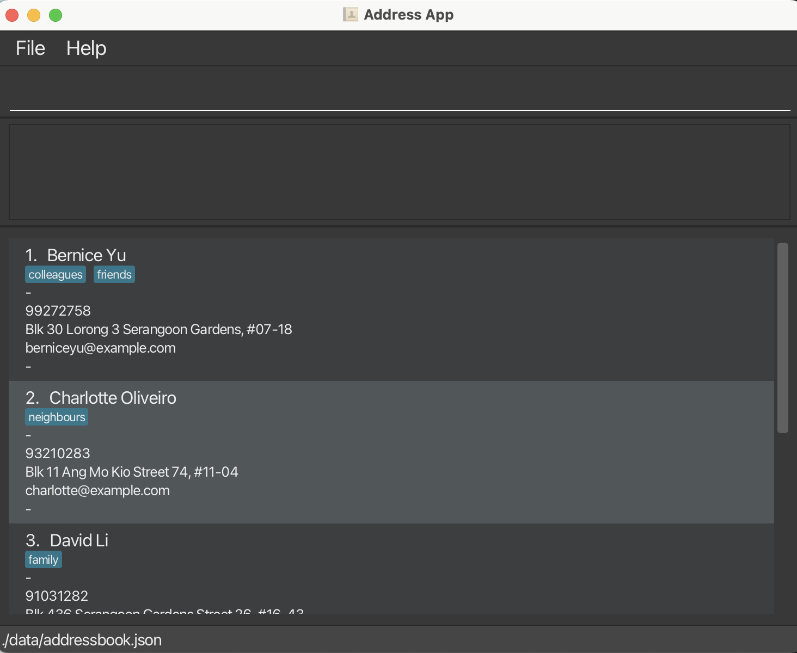

TeacherBook CLI is a **desktop app for managing student and parent contacts, optimized for use via a Command Line Interface** (CLI) while still providing the benefits of a Graphical User Interface (GUI). If you can type fast, TeacherBook CLI can help you manage classroom contact information more efficiently than traditional GUI apps.

* Table of Contents
{:toc}

--------------------------------------------------------------------------------------------------------------------

## Quick start

1. Ensure you have Java `17` or above installed in your Computer. 
   **Mac users:** Ensure you have the precise JDK version prescribed [here](https://se-education.org/guides/tutorials/javaInstallationMac.html).

1. Download the latest `.jar` file from the [TeacherBook CLI releases page](https://github.com/AY2526S2-CS2103-F09-3/tp/releases).

1. Copy the file to the folder you want to use as the _home folder_ for your AddressBook.

1. Open a command terminal, `cd` into the folder you put the jar file in, and use the `java -jar addressbook.jar` command to run the application. 
   A GUI similar to the below should appear in a few seconds. Note how the app contains some sample data. 
   

1. Type the command in the command box and press Enter to execute it. e.g. typing **`help`** and pressing Enter will open the help window. 
   Some example commands you can try:

   * `list` : Lists all contacts.

   * `add n/John Doe p/98765432 e/johnd@example.com a/John street, block 123, #01-01` : Adds a contact named `John Doe` to the Address Book.

   * `delete 3` : Deletes the 3rd contact shown in the current list.

   * `clear` : Deletes all contacts.

   * `sort` : Sort all contacts by address (default).
   
   * `sort name` : Sort all contacts by name alphabetically.

   * `import C:\data\contacts.csv` : Imports contacts from a CSV file.

   * `export C:\data\contacts.csv` : Exports all contacts to a CSV file.

   * `exit` : Exits the app.

1. Refer to the [Features](#features) below for details of each command.

--------------------------------------------------------------------------------------------------------------------

## Features

**:information_source: Notes about the command format:** 

* Words in `UPPER_CASE` are the parameters to be supplied by the user. 
  e.g. in `add n/NAME`, `NAME` is a parameter which can be used as `add n/John Doe`.

* Items in square brackets are optional. 
  e.g `n/NAME [t/TAG]` can be used as `n/John Doe t/friend` or as `n/John Doe`.

* Items with `…`​ after them can be used multiple times including zero times. 
  e.g. `[t/TAG]…​` can be used as ` ` (i.e. 0 times), `t/friend`, `t/friend t/family` etc.

* Parameters can be in any order. 
  e.g. if the command specifies `n/NAME p/PHONE_NUMBER`, `p/PHONE_NUMBER n/NAME` is also acceptable.

* Extraneous parameters for commands that do not take in parameters (such as `list`, `exit` and `clear`) will be ignored. 
  e.g. if the command specifies `list 123`, it will be interpreted as `list`.

* If you are using a PDF version of this document, be careful when copying and pasting commands that span multiple lines as space characters surrounding line-breaks may be omitted when copied over to the application.

### Viewing help : `help`

Shows usage information in the help window. You can also target a specific command.

Formats:
- `help` — opens the help window with the full command summary.
- `help COMMAND_WORD` — shows usage for that command (e.g., `help add`, `help list`).

Tip: The help window includes a link to the full User Guide.

### Adding a person: `add`

Adds a person to the address book.

Format: `add n/NAME p/PHONE_NUMBER e/EMAIL a/ADDRESS [c/CLASS] [t/TAG]…​`

* `CLASS` refers to the student's class (e.g. 3A, 4B). Must be alphanumeric.

:bulb: **Tip:**
A person can have any number of tags (including 0)

Examples:
* `add n/John Doe p/98765432 e/johnd@example.com a/John street, block 123, #01-01`
* `add n/Betsy Crowe t/friend e/betsycrowe@example.com a/Newgate Prison p/1234567 c/3A t/criminal`

### Listing all persons : `list`

Shows a list of all persons in the address book.

Format: `list`

### Sorting all persons : `sort`

Shows a list of all persons in the address book sorted by the selected field.

Format: `sort [address|name]`
* `sort` and `sort address` sort by address alphabetically.
* `sort name` sorts by name alphabetically.

### Importing persons from CSV : `import`

Imports persons from a CSV file.

Format: `import FILE_PATH`

CSV row format:
`name,phone,email,address[,class][,tag1;tag2;...]`

Notes:
* The first row can be a header (e.g. `name,phone,email,address,class,tags`) and it will be ignored.
* Rows with invalid data are skipped.
* Duplicate persons (same name) are skipped.
* Up to 10 skipped-row reasons are shown after import.
* Addresses containing commas should be wrapped in double quotes.
* Tags are optional and should be separated with semicolons (`;`).

Examples:
* `import C:\data\contacts.csv`
* `import data\new_contacts.csv`

### Exporting persons to CSV : `export`

Exports all persons from the address book to a CSV file.

Format: `export FILE_PATH`

Notes:
* The command writes a CSV header: `name,phone,email,address,class,tags`.
* If needed, parent folders in the given path are created automatically.
* Existing files at the same path will be overwritten.
* Tags are exported as a semicolon-separated list.

Examples:
* `export C:\data\contacts.csv`
* `export data\backup\contacts.csv`

### Editing a person : `edit`

Edits an existing person in the address book.

Format: `edit INDEX [n/NAME] [p/PHONE] [e/EMAIL] [a/ADDRESS] [c/CLASS] [t/TAG]…​`

* Edits the person at the specified `INDEX`. The index refers to the index number shown in the displayed person list. The index **must be a positive integer** 1, 2, 3, …​
* At least one of the optional fields must be provided.
* Existing values will be updated to the input values.
* When editing tags, the existing tags of the person will be removed i.e adding of tags is not cumulative.
* You can remove all the person’s tags by typing `t/` without specifying any tags after it.
* You can clear the person's class by typing `c/` without specifying a value after it.

Examples:
*  `edit 1 p/91234567 e/johndoe@example.com` Edits the phone number and email address of the 1st person to be `91234567` and `johndoe@example.com` respectively.
*  `edit 2 n/Betsy Crower t/` Edits the name of the 2nd person to be `Betsy Crower` and clears all existing tags.
*  `edit 1 c/4B` Edits the class of the 1st person to `4B`.

### Filtering persons by class: `filter`

Filters and displays persons who belong to the specified class.

Format: `filter c/CLASS`

* The filter is case-insensitive. e.g. `c/3a` will match persons in class `3A`.
* Only persons with a matching class are shown. Use `list` to show all persons again.

Examples:
* `filter c/3A` Shows all persons in class 3A.
* `filter c/4B` Shows all persons in class 4B.

### Locating persons by name: `find`

Finds persons whose names contain any of the given keywords.

Format: `find KEYWORD [MORE_KEYWORDS]`

* The search is case-insensitive. e.g `hans` will match `Hans`
* The order of the keywords does not matter. e.g. `Hans Bo` will match `Bo Hans`
* Only the name is searched.
* Only full words will be matched e.g. `Han` will not match `Hans`
* Persons matching at least one keyword will be returned (i.e. `OR` search).
  e.g. `Hans Bo` will return `Hans Gruber`, `Bo Yang`

Examples:
* `find John` returns `john` and `John Doe`
* `find alex david` returns `Alex Yeoh`, `David Li` 
  

### Adding a tag cumulatively: `tag`

Adds one or more specified tags to a given person.

Format: `tag INDEX t/TAG [t/MORE_TAGS]…`

Examples:
* `tag 2 t/support` Adds the tag `support` to the 2nd person's existing tags.
* `tag 5 t/exco t/hons` Adds the tags `exco` and `hons` to the 5th person's existing tags.

### Adding or clearing a remark: `remark`

Adds a remark to a person, or clears the existing remark.

Format: `remark INDEX r/[REMARK]`

* Adds or updates the remark of the person at the specified `INDEX`.
* You can clear a person's remark by typing `r/` followed only by spaces.

Examples:
* `remark 1 r/Allergic to peanuts` Adds a remark to the 1st person.
* `remark 2 r/   ` Clears the remark of the 2nd person.

### Flagging a person for follow-up: `flag`

Flags a person with a follow-up reason.

Format: `flag INDEX r/REASON`

* Flags the person at the specified `INDEX`.
* The reason is shown in the dashboard and can be removed later using `unflag`.

Examples:
* `flag 3 r/Missing consent form for field trip`
* `flag 1 r/Parent requested a callback`

### Removing a follow-up flag: `unflag`

Removes an existing follow-up flag from a person.

Format: `unflag INDEX`

Examples:
* `unflag 3`

### Viewing flagged contacts: `dashboard`

Shows a summary of all currently flagged contacts and filters the displayed list to them.

Format: `dashboard`

Examples:
* `dashboard`

### Undoing the previous change: `undo`

Reverts the most recent command that modified the address book.

Format: `undo`

Examples:
* `undo`

### Redoing the previous undo: `redo`

Restores the most recently undone command.

Format: `redo`

Examples:
* `redo`

### Deleting person(s) : `delete`

Deletes one or more specified persons from the address book.

Format: `delete INDEX [MORE_INDICES]`

Alternative formats:
* `delete START_INDEX-END_INDEX`
* `delete all`

* Deletes the person(s) at the specified index or indices.
* The indices refer to the index numbers shown in the displayed person list.
* Each index **must be a positive integer** 1, 2, 3, …​
* `delete 1 3 5` deletes multiple displayed persons in one command.
* `delete 2-5` deletes a range of displayed persons.
* `delete all` deletes all persons currently shown in the displayed list.

Examples:
* `list` followed by `delete 2` deletes the 2nd person in the address book.
* `list` followed by `delete 1 3 5` deletes the 1st, 3rd, and 5th persons in the address book.
* `list` followed by `delete 2-4` deletes the 2nd to 4th persons in the address book.
* `find Betsy` followed by `delete 1` deletes the 1st person in the results of the `find` command.
* `filter c/3A` followed by `delete all` deletes all currently displayed persons in class `3A`.

### Clearing all entries : `clear`

Clears all entries from the address book.

Format: `clear`

### Exiting the program : `exit`

Exits the program.

Format: `exit`

### Saving the data

AddressBook data are saved in the hard disk automatically after any command that changes the data. There is no need to save manually.

### Editing the data file

AddressBook data are saved automatically as a JSON file `[JAR file location]/data/addressbook.json`. Advanced users are welcome to update data directly by editing that data file.

:exclamation: **Caution:**
If your changes to the data file makes its format invalid, AddressBook will discard all data and start with an empty data file at the next run. Hence, it is recommended to take a backup of the file before editing it. 
Furthermore, certain edits can cause the AddressBook to behave in unexpected ways (e.g., if a value entered is outside of the acceptable range). Therefore, edit the data file only if you are confident that you can update it correctly.

### Archiving data files `[coming in v2.0]`

_Details coming soon ..._

--------------------------------------------------------------------------------------------------------------------

## FAQ

**Q**: How do I transfer my data to another Computer? 
**A**: Install the app in the other computer and overwrite the empty data file it creates with the file that contains the data of your previous AddressBook home folder.

--------------------------------------------------------------------------------------------------------------------

## Known issues

1. **When using multiple screens**, if you move the application to a secondary screen, and later switch to using only the primary screen, the GUI will open off-screen. The remedy is to delete the `preferences.json` file created by the application before running the application again.
2. **If you minimize the Help Window** and then run the `help` command (or use the `Help` menu, or the keyboard shortcut `F1`) again, the original Help Window will remain minimized, and no new Help Window will appear. The remedy is to manually restore the minimized Help Window.

--------------------------------------------------------------------------------------------------------------------

## Command summary

Action | Format, Examples
--------|------------------
**Add** | `add n/NAME p/PHONE_NUMBER e/EMAIL a/ADDRESS [c/CLASS] [t/TAG]…​`   e.g., `add n/James Ho p/22224444 e/jamesho@example.com a/123, Clementi Rd, 1234665 c/3A t/friend t/colleague`
**Clear** | `clear`
**Delete** | `delete INDEX [MORE_INDICES]`  e.g., `delete 3`, `delete 1 3 5`, `delete all`
**Edit** | `edit INDEX [n/NAME] [p/PHONE] [e/EMAIL] [a/ADDRESS] [c/CLASS] [t/TAG]…​`  e.g., `edit 2 n/James Lee e/jameslee@example.com`
**Flag** | `flag INDEX r/REASON`  e.g., `flag 3 r/Missing consent form`
**Filter** | `filter c/CLASS`  e.g., `filter c/3A`
**Find** | `find KEYWORD [MORE_KEYWORDS]`  e.g., `find James Jake`
**Import** | `import FILE_PATH`  e.g., `import C:\data\contacts.csv`
**Export** | `export FILE_PATH`  e.g., `export C:\data\contacts.csv`
**Dashboard** | `dashboard`
**Remark** | `remark INDEX r/[REMARK]`  e.g., `remark 1 r/Allergic to peanuts`
**Tag** | `tag INDEX t/TAG [t/MORE_TAGS]`  e.g., `tag 1 t/exco`
**Unflag** | `unflag INDEX`  e.g., `unflag 3`
**List** | `list`
**Sort** | `sort [address\|name]`  e.g., `sort`, `sort name`
**Undo** | `undo`
**Redo** | `redo`
**Help** | `help`
